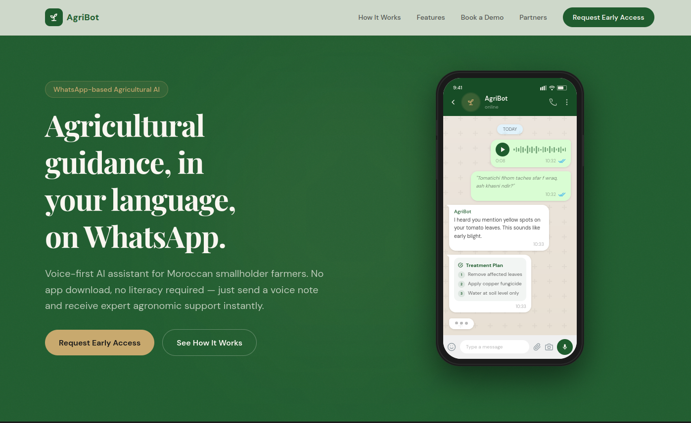

#  AgriBot UI

Modern marketing and product landing UI for **AgriBot**, a voice-first agricultural assistant designed for Moroccan smallholder farmers.




## Overview

AgriBot UI presents the product story end-to-end:
- Problem context for farmers
- How the product works
- Feature highlights
- Interactive demo section
- Demo booking CTA
- Partner showcase and final conversion section

The app is built with Next.js App Router and optimized for responsive performance.

## Tech Stack

- Next.js 16 (App Router)
- React 19
- TypeScript
- Tailwind CSS 4
- Radix UI primitives
- Netlify deployment target

## Project Structure

```text
app/                # App Router pages, layout, metadata, global styles
components/         # Landing page sections + shared UI components
hooks/              # Reusable React hooks
lib/                # Utility helpers
public/             # Static assets (images, favicon, icons)
```

## Getting Started (Local Development)

### 1. Install dependencies

```bash
pnpm install
```

If you use npm:

```bash
npm install
```

### 2. Run the development server

```bash
pnpm dev
```

Open `http://localhost:3000`.

## Build for Production

```bash
pnpm build
pnpm start
```

## Environment Variables

Create a local env file if needed:

```bash
.env.local
```

For production, set environment variables in your hosting provider dashboard (Netlify), not in committed `.env` files.

## Deployment (Netlify)

This project is configured for Netlify with Next.js runtime support.

Key points:
- Build command: `pnpm build`
- Next.js runtime plugin enabled via `netlify.toml`
- DNS and HTTPS handled in Netlify domain management

## Favicon & Branding

Favicon assets live in:
- `public/favicon.svg`
- `public/favicon-16x16.png`
- `public/favicon-32x32.png`

Metadata icon configuration is defined in `app/layout.tsx`.

## Scripts

- `pnpm dev` — run development server
- `pnpm build` — create production build
- `pnpm start` — run production server
- `pnpm lint` — run lint checks

## License

Private project. All rights reserved.
